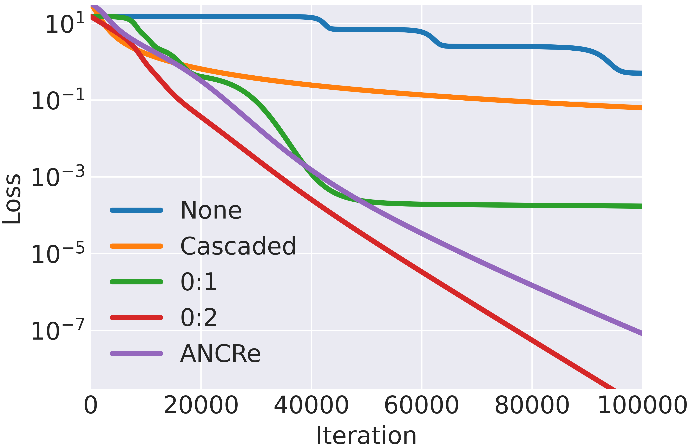
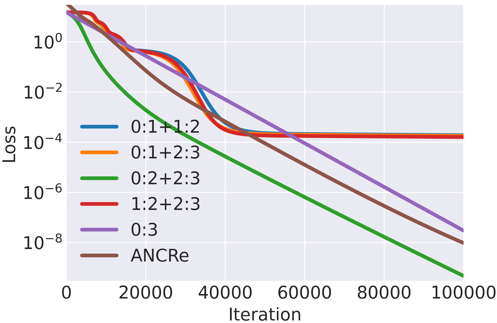
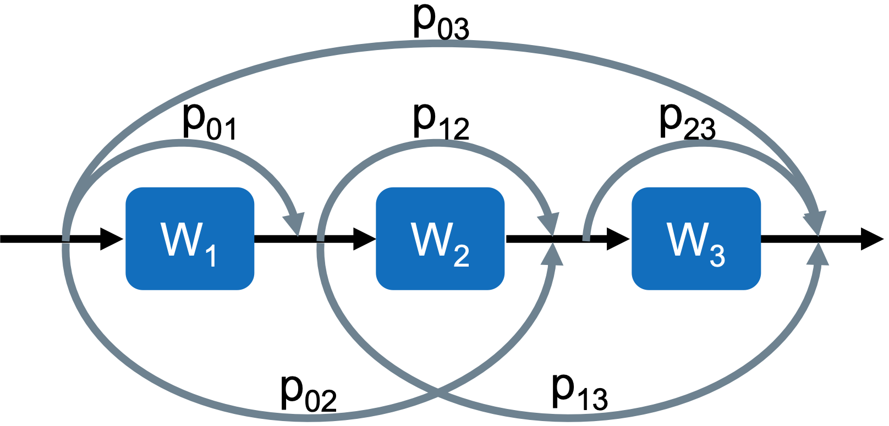
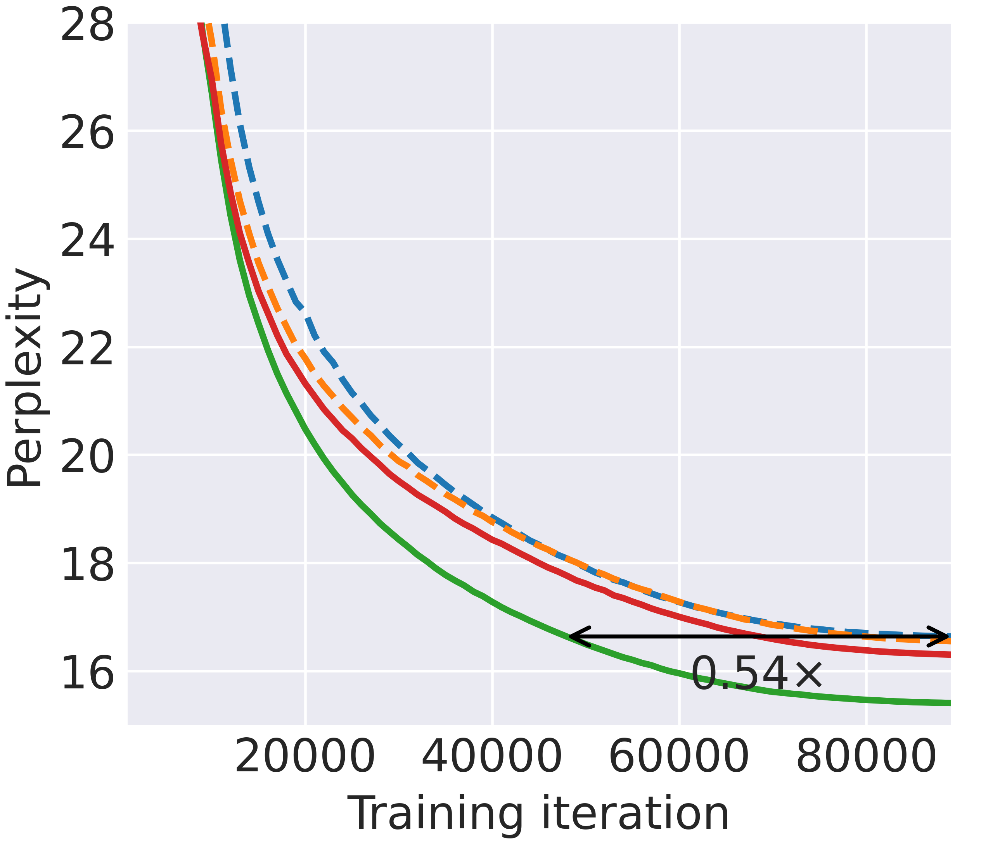
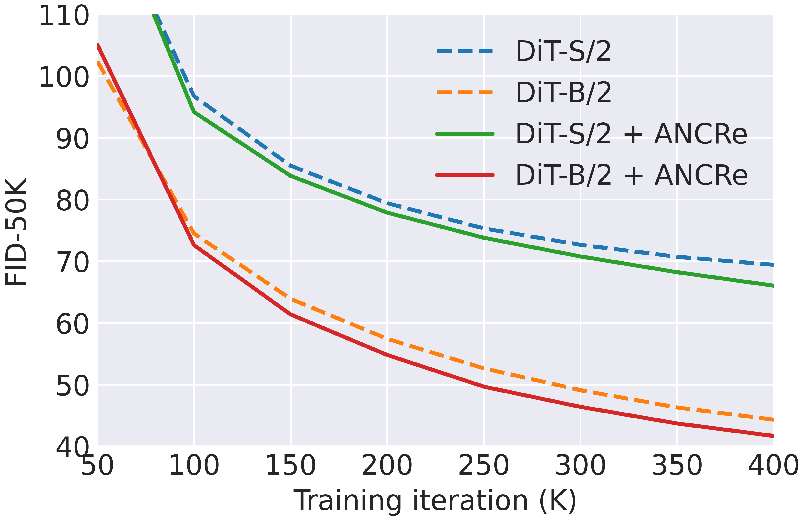
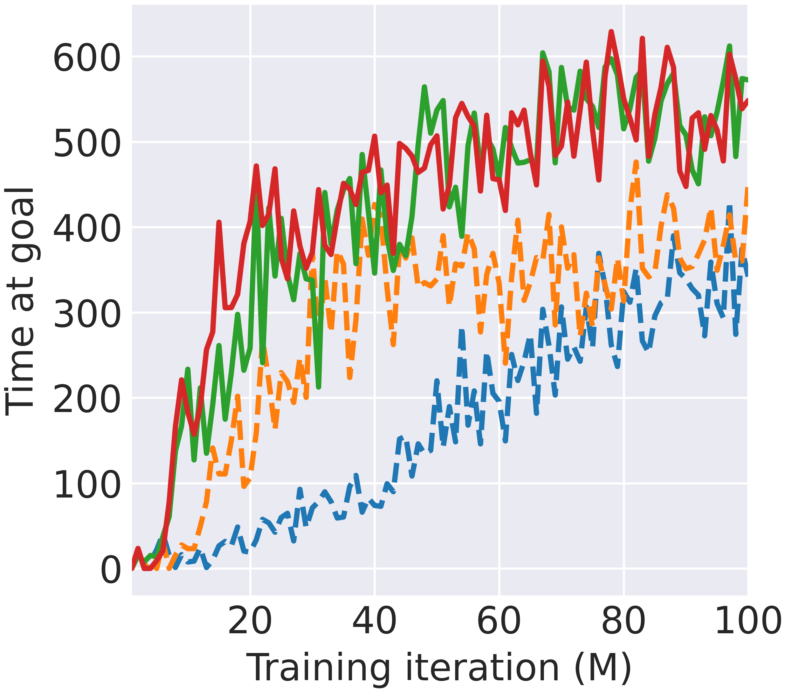

# ANCRe: Adaptive Neural Connection Reassignment for Efficient Depth Scaling

[](https://arxiv.org/abs/2602.09009)

This repository contains the official implementation of **ANCRe**, together with code to reproduce the experiments on LLM pre-training, diffusion models, and deep reinforcement learning.

## Overview

Going deeper is a key driver of modern foundation models, yet deep layers are often underutilized. For example, dropping a late layer of Llama 3.1 70B changes its outputs far less than dropping an early one. We revisit the default tool for going deep, residual connections, and ask: *where should the shortcuts go?*

**Topology matters.** In deep linear networks, the placement of shortcuts alone determines how fast training converges. Here `i:j` is a shortcut from the output of layer `i` to that of layer `j`, with `0` the input. With 3 layers (left), a single `0:2` shortcut converges far faster than `0:1` or the standard cascaded layout. With 4 layers (right), the best layout becomes `0:2+2:3`, and extra shortcuts help only when they are well placed.

<p align="center">
  
  &nbsp;&nbsp;
  
</p>

**Theory: an exponential gap.** Consider a 3-layer linear network trained by gradient flow on whitened inputs ($XX^\top = I$), with a single shortcut `0:1` or `0:2`:

$$\mathcal{L}_{0:1} = \frac{1}{2}\big\Vert W_3 W_2 (W_1 + I) X - Y \big\Vert_F^2, \qquad \mathcal{L}_{0:2} = \frac{1}{2}\big\Vert W_3 (W_2 W_1 + I) X - Y \big\Vert_F^2 .$$

- **`0:1` is slow (Theorem 3.2).** There *exists* a sufficiently small initialization under which convergence is at best sublinear: $\mathcal{L}_{0:1}(t) \ge \Omega(1/t^2)$.
- **`0:2` is fast (Theorem 3.3).** Under *any* sufficiently small initialization, convergence is linear: $\mathcal{L}_{0:2}(t) \le \mathcal{L}_{0:2}(0)\, e^{-2(1-\lambda)^2 t}$, where $\lambda \in (0,1)$ depends on the initialization.

Both results extend to any depth $K$: `0:1` remains sublinear, while `0:K−1` guarantees linear convergence.

**So learn it.** The best topology depends on depth and architecture, so ANCRe learns it instead of fixing it by hand. It considers every shortcut `i:j` and learns a softmax-normalized coefficient `p_ij` for each one, jointly with the model weights. On the linear networks above, it converges linearly like the best fixed topology, without being told which one that is. It adds only K(K+1)/2 scalars and less than 1% overhead.

<p align="center">
  
</p>

**Results.**
- **LLM pre-training (LLaMA 60M–1B):** ANCRe lowers perplexity at every scale, with both full-parameter training and GaLore. It reaches the baseline's perplexity with 34.3% fewer iterations on average, a 1.85× speedup on LLaMA-1B.
- **Diffusion (DiT-S/2, DiT-B/2):** ANCRe converges faster and improves FID, sFID, IS, precision and recall, by about 6% on average.
- **Deep RL (ResNets):** a 16-layer ResNet with ANCRe matches or beats a 4× deeper 64-layer baseline.

<table align="center">
  <tr>
    <td align="center"></td>
    <td align="center"></td>
    <td align="center"></td>
  </tr>
  <tr>
    <td align="center"><sub><b>LLaMA-1B</b>, validation PPL<br>dashed: FullPT (blue), GaLore (orange)<br>solid: + ANCRe (green, red)</sub></td>
    <td align="center"><sub><b>DiT</b>, FID-50K on ImageNet 256×256</sub></td>
    <td align="center"><sub><b>Arm Push Hard</b>, time at goal<br>dashed: ResNet-16 (blue), ResNet-64 (orange)<br>solid: + ANCRe (green, red)</sub></td>
  </tr>
</table>

## Installation

```bash
git clone <this-repo> && cd ancre
conda create -n ancre python=3.12 -y && conda activate ancre
pip install -r requirements.txt
```

The RL experiments use JAX and a separate environment; see [rl/README.md](rl/README.md).

## Quick start

ANCRe is a drop-in module for any stack of residual blocks:

```python
from ancre import ANCReConfig, AdaptiveNeuralConnectionReassign

ancre = AdaptiveNeuralConnectionReassign(ANCReConfig(num_layers=len(blocks), softmax_temp=1e-2))

x = ancre(x, layer_idx=-1)
for idx, block in enumerate(blocks):
    x = block(x)
    x = ancre(x, layer_idx=idx)
```

## Reproducing results

| Directory | Experiment | Paper |
|---|---|---|
| [`llm/`](llm/) | LLaMA pre-training on C4 (full-parameter and GaLore) | Sec. 5.1 |
| [`dm/`](dm/) | DiT pre-training on ImageNet 256×256 | Sec. 5.2 |
| [`rl/`](rl/) | Goal-conditioned RL with deep ResNets | Sec. 5.3 |

To run a baseline with cascaded residual connections, drop the ANCRe flags (`--use_ancre` / `--use-ancre`).

### LLM pre-training

```bash
cd llm
bash scripts/llama_60m_ancre.sh         # FullPT + ANCRe
bash scripts/llama_60m_galore_ancre.sh  # GaLore + ANCRe
```

Scripts for 60M / 130M / 350M / 1B are in [`llm/scripts/`](llm/scripts/).

| Validation PPL (↓) | 60M | 130M | 350M | 1B |
|---|:-:|:-:|:-:|:-:|
| FullPT | 30.39 | 25.07 | 19.00 | 16.64 |
| FullPT + ANCRe | **29.62** | **24.48** | **18.32** | **15.41** |
| GaLore | 34.61 | 25.56 | 19.62 | 16.55 |
| GaLore + ANCRe | **33.69** | **24.68** | **19.01** | **16.45** |

### Diffusion models

```bash
cd dm
bash scripts/DiT-S-2_ancre.sh
# evaluate all checkpoints of a run (results/<NNN>-DiT-S-2 is created by train.py)
bash scripts/sample_ddp.sh results/000-DiT-S-2 DiT-S/2 --use-ancre --ancre-softmax-temp 1e-2
```

ImageNet-1K is loaded from the gated HuggingFace dataset [`ILSVRC/imagenet-1k`](https://huggingface.co/datasets/ILSVRC/imagenet-1k), so run `huggingface-cli login` first. Evaluation follows [ADM](https://github.com/openai/guided-diffusion/tree/main/evaluations) and requires the reference batch [`VIRTUAL_imagenet256_labeled.npz`](https://openaipublic.blob.core.windows.net/diffusion/jul-2021/ref_batches/imagenet/256/VIRTUAL_imagenet256_labeled.npz) in `dm/reference_batch/`.

| Model (400K iters) | FID (↓) | sFID (↓) | IS (↑) | Prec. (↑) | Rec. (↑) |
|---|:-:|:-:|:-:|:-:|:-:|
| DiT-S/2 | 69.40 | 12.45 | 19.66 | 35.75 | 55.82 |
| DiT-S/2 + ANCRe | **66.01** | **11.68** | **20.70** | **37.90** | **57.80** |
| DiT-B/2 | 44.31 | 8.42 | 32.89 | 47.93 | 61.55 |
| DiT-B/2 + ANCRe | **41.66** | **7.89** | **34.40** | **50.42** | **64.20** |

### Reinforcement learning

```bash
cd rl
uv sync                               # then apply the two Brax fixes in rl/README.md
bash scripts/train_ArmPushHard.sh
```

Scripts for Humanoid, Ant Big Maze, Arm Push Hard and Arm Binpick Hard are in [`rl/scripts/`](rl/scripts/).

## Acknowledgement

We thank the authors of the following projects for releasing their code:
- [GaLore](https://github.com/jiaweizzhao/GaLore) for LLM pre-training (`llm/`).
- [DiT](https://github.com/facebookresearch/DiT) for diffusion models (`dm/`). This part stays under DiT's [CC BY-NC 4.0](dm/LICENSE) license.
- [scaling-crl](https://github.com/wang-kevin3290/scaling-crl) for deep RL (`rl/`).

## Citation

```bibtex
@inproceedings{zhang2026ancre,
  title     = {{ANCRe}: Adaptive Neural Connection Reassignment for Efficient Depth Scaling},
  author    = {Zhang, Yilang and Li, Bingcong and He, Niao and Giannakis, Georgios B.},
  booktitle = {Advances in Neural Information Processing Systems},
  year      = {2026}
}
```
